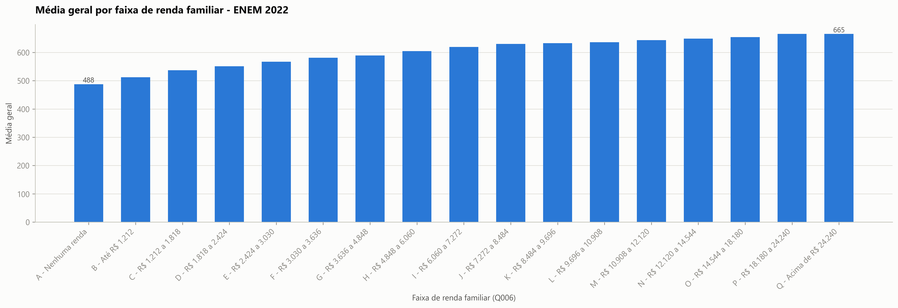
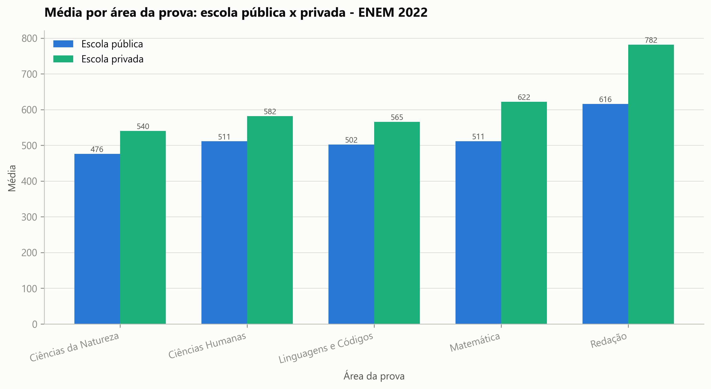

# Fatores Socioeconômicos Associados ao Desempenho no ENEM 2022

Projeto de portfólio de **Análise de Dados** usando os Microdados públicos do
ENEM 2022 (INEP). O objetivo é investigar como características socioeconômicas
dos participantes se **associam** ao desempenho nas provas e à presença nos
dois dias de aplicação — sem afirmar causalidade.

## Problema analisado

O ENEM é a principal porta de entrada para o ensino superior no Brasil. Este
projeto quantifica as diferenças de desempenho observadas entre grupos:

1. Qual é a distribuição geral das notas dos participantes?
2. As notas variam conforme o tipo de escola?
3. Existe diferença de desempenho por faixa de renda familiar?
4. A escolaridade dos pais está associada às notas?
5. Participantes com internet em casa têm média diferente dos demais?
6. Participantes com computador em casa têm média diferente dos demais?
7. Quais UFs apresentam maiores médias?
8. Como a taxa de ausência varia por renda, tipo de escola e UF?
9. Quais áreas da prova têm maior variação entre grupos socioeconômicos?
10. Quais conclusões podem ser tiradas sem afirmar causalidade indevida?

## Fonte dos dados

- **Microdados do ENEM 2022 — INEP** (dados públicos, com adequações de
  privacidade/LGPD aplicadas pelo próprio INEP).
- Download oficial: <https://www.gov.br/inep/pt-br/acesso-a-informacao/dados-abertos/microdados/enem>
- Arquivo principal: `MICRODADOS_ENEM_2022.csv` (~1,5 GB, 76 colunas,
  separador `;`, encoding `latin1`).
- **A base completa não está incluída neste repositório por causa do tamanho.**
  Baixe o pacote oficial e extraia a pasta `DADOS/` ao lado deste projeto.

## Estrutura do projeto

```
base enem/                      <- pasta raiz (fora do repositório: DADOS/, DICIONÁRIO/ etc.)
└── projeto_enem_2022/
    ├── README.md
    ├── requirements.txt
    ├── .gitignore
    ├── data_dictionary.md      <- dicionário das variáveis usadas
    ├── docs/
    │   ├── metodologia.md
    │   ├── limitacoes_do_estudo.md
    │   └── conclusoes.md
    ├── src/
    │   ├── utils.py                    <- caminhos, mapeamentos e helpers
    │   ├── 01_diagnostico_colunas.py
    │   ├── 02_criar_amostra.py
    │   ├── 03_tratar_dados.py
    │   ├── 04_analise_exploratoria.py
    │   ├── 05_gerar_graficos.py
    │   └── 06_gerar_relatorio.py
    ├── notebooks/
    │   └── 01_analise_enem_2022.ipynb
    ├── outputs/
    │   ├── tabelas/            <- CSVs de análise (UTF-8 com BOM)
    │   ├── graficos/           <- PNGs (dpi 300)
    │   └── relatorio_final.md
    └── sql/
        └── consultas_analiticas.sql
```

## Ferramentas usadas

- **Python 3.12** — pandas, numpy, matplotlib, openpyxl
- **SQL** (consultas analíticas de referência)
- Leitura seletiva de colunas e leitura em chunks para a base completa

## Como executar

```bash
# 1. instalar dependências
pip install -r requirements.txt

# 2. rodar o pipeline em ordem, a partir da pasta src/
cd src
python 01_diagnostico_colunas.py     # confirma o arquivo e lista as colunas
python 02_criar_amostra.py           # amostra padrão de 300.000 linhas
python 03_tratar_dados.py            # limpeza, filtros e variáveis derivadas
python 04_analise_exploratoria.py    # tabelas CSV em outputs/tabelas
python 05_gerar_graficos.py          # gráficos PNG em outputs/graficos
python 06_gerar_relatorio.py         # outputs/relatorio_final.md
```

Para processar a **base completa** (em chunks, sem estourar memória):

```bash
python 02_criar_amostra.py --completa
# depois repita os passos 03 a 06
```

Outros tamanhos de amostra: `python 02_criar_amostra.py --linhas 500000`.

## Exemplos de gráficos gerados

| | |
|---|---|
|  |  |
| Média geral por faixa de renda | Média por área: pública x privada |

## Principais conclusões (amostra de 300 mil linhas)

- A média geral cresce quase monotonicamente com a renda familiar: **~488
  pontos** na faixa "nenhuma renda" contra **~666** nas faixas mais altas.
- Escola **privada** supera a pública em **~95 pontos** na média geral, com
  maior diferença em Redação e Matemática.
- A escolaridade da mãe está associada a uma diferença de **~112 pontos**
  entre os extremos (pós-graduação x nunca estudou).
- Internet e computador em casa estão associados a médias maiores.
- **A ausência às provas também é desigual**: ~36% de ausência na faixa sem
  renda contra ~15% nas faixas mais altas — a desigualdade começa antes da nota.
- Redação e Matemática são as áreas mais sensíveis ao perfil socioeconômico.

Relatório completo: [outputs/relatorio_final.md](outputs/relatorio_final.md)

## Limitações

- Análise baseada em **amostra** (primeiras 300 mil linhas), salvo reexecução
  com `--completa`; a ordem das linhas pode não ser aleatória.
- Diferenças brutas, sem testes de significância nem controle de variáveis.
- **Associação não significa causalidade** — os fatores analisados são
  fortemente correlacionados entre si.
- Grande parte dos participantes não informa o tipo de escola.

Detalhes em [docs/limitacoes_do_estudo.md](docs/limitacoes_do_estudo.md).

## Próximos passos

- Reexecutar o pipeline na base completa (`--completa`).
- Amostragem aleatória em vez das primeiras N linhas.
- Modelos de regressão para estimar associações controladas.
- Análise específica dos ausentes e dos treineiros.
- Dashboard interativo (Power BI ou Streamlit).
